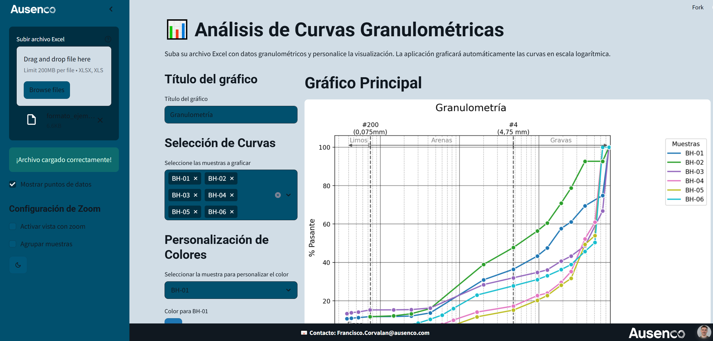

# 📊 Aplicación de Análisis Granulométrico en Streamlit

[](https://granulometriaplots.streamlit.app/)

Esta aplicación permite procesar datos granulométricos a partir de tablas en formato Excel, generar gráficos personalizados de curvas granulométricas, y clasificar suelos utilizando la metodología **USCS (Unified Soil Classification System)**.

---

## 🚀 Funcionalidades principales

- 📁 Carga de archivos Excel con datos granulométricos y de plasticidad.
- 📉 Visualización interactiva de curvas granulométricas en escala logarítmica.
- 🎨 Personalización de colores y títulos.
- 🔍 Opción de zoom por rango de tamaños.
- 🧪 Clasificación automática de muestras según la norma **ASTM D2487** (USCS).
- 💾 Descarga de resultados procesados en Excel.
- 🧑‍🏫 Sección de ayuda y manual de usuario con formato de ejemplo descargable.

---

## 🖼️ Captura de pantalla

  <!-- Podés reemplazar con tu propia imagen -->

---

## 📂 Estructura esperada del archivo de entrada

La aplicación espera un archivo Excel con el siguiente formato:

| Nombre | BH-01 | BH-02 |
|--------|-------|-------|
| LL     | 35.0  | 32.0  |
| IP     | 15.0  | 10.0  |
| Tamaño | % Pasante | % Pasante |
| 76.2   | 100   | 100   |
| 63.5   | 90    | 85    |
| ...    | ...   | ...   |

Podés descargar un ejemplo de archivo desde la misma app o hacer clic aquí: [📥 Descargar formato ejemplo](https://granulometriaplots.streamlit.app/)

---

## 🧑‍💻 Cómo ejecutar localmente

1. Cloná este repositorio:

```bash
git clone https://github.com/francorvalan/granulometria-streamlit.git
cd granulometria-streamlit
